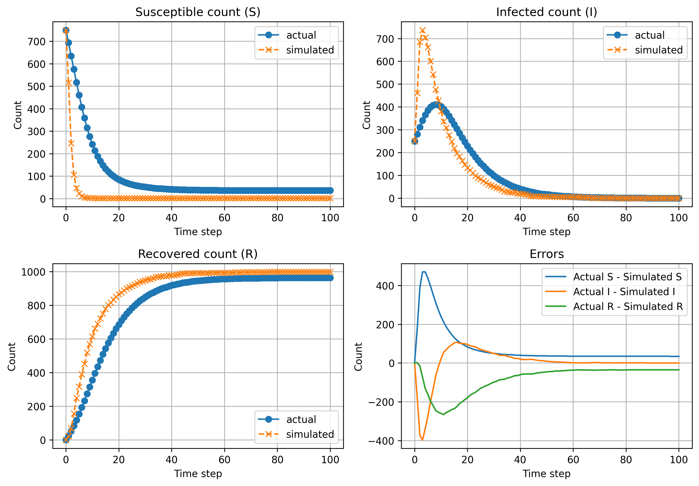

## SIR Model simulation on Barabási–Albert (BA) networks

> Authored by: Sam Ruben Abraham and Anushka Kishor Nikam

This repository demonstrates Monte Carlo simulations of epidemic spread using the SIR (Susceptible–Infected–Recovered) model run on Barabási–Albert graphs. It contains C++ implementations of the simulator and small Python utilities for visualization and comparisons.

### Repository contents (high level)

- `sir_bam_serial.cpp` — Serial C++ implementation of the SIR model on a BA graph.
- `sir_bam_parallel.cpp` — (if present) Parallel/OpenMP variant.
- `sir_actual.cpp` — Uses the actual SIR differential equations (numerical integration) to produce the expected S/I/R time series.
- `params.txt` — Text file with simulation parameters (population size, rates, etc.).
- `make_gif.py` — Python helper to assemble PNG frames into `sim/epidemic.gif`.
- `graph.py` — Python script to compare simulation vs actual time series and save `sim/comparison.png`.
- `sim/` — Output folder (frames, CSVs, generated images and GIF).

### Key source files

- `sir_bam_serial.cpp` — Serial C++ implementation of the SIR model on a BA graph.
- `sir_bam_parallel.cpp` — Parallel/OpenMP variant of the simulator (build with `-fopenmp`).
- `sir_actual.cpp` — Uses the actual SIR differential equations (numerical integration) to produce the expected S/I/R time series.

`graph.py` details

`graph.py` reads `sim/actual.csv` and `sim/simulated.csv` and generates comparison plots of S, I, and R time series (and the error plot). It also saves the comparison image to `sim/comparison.png`.

### Prerequisites

- A C++ compiler such as `g++` (MinGW on Windows) for the simulation code - `g++` is highly recommended.
- Python 3 (preferably the latest versions)

### Installation (Python)

Create a virtual environment (recommended) and install Python dependencies:

```powershell
python -m venv .venv
.\.venv\Scripts\Activate.ps1
pip install -r requirements.txt
```

Or install directly into your active environment:

```powershell
pip install -r requirements.txt
```

### Quick start — build and run

1. Build the serial simulator (example using g++ on Windows/PowerShell):

```powershell
g++ sir_bam_serial.cpp -o sir_bam_serial.exe
```

2. Configure parameters: edit `params.txt` to set population size, infection/recovery rates, seed, number of steps, etc.

3. Run the simulator:

```powershell
.\sir_bam_serial.exe
```

Outputs will be written into the `sim/` directory.

### Compilation notes

- Serial simulation and the actual-equations program:

```powershell
g++ -o sir_bam_serial.exe sir_bam_serial.cpp
g++ -o sir_actual.exe sir_actual.cpp
```

- Parallel build (OpenMP):

```powershell
g++ -fopenmp -o sir_bam_parallel.exe sir_bam_parallel.cpp
```

Make sure your compiler supports OpenMP (e.g., recent MinGW-w64 builds or GCC on Unix-like systems - hence the recommendation).

### Visualize the results

- To generate a GIF from frame PNGs (if frames exist):

```powershell
python make_gif.py
```

- To produce a comparison plot of actual vs simulated S/I/R time series and save `sim/comparison.png`, run:

```powershell
python graph.py
```

Files produced by the simulation

- `sim/frame_*.png` — individual frames showing node states at each time step.
- `sim/epidemic.gif` — assembled animation of frames.
- `sim/states.csv` — node state timeline (rows = time steps, columns = node states as 0/1/2).
- `sim/actual.csv`, `sim/simulated.csv` — example time series used by `graph.py` to create `sim/comparison.png`.

Notes and tips

- The repository includes both serial and (optional) parallel C++ implementations. Use `-fopenmp` and the parallel executable when available to speed up large runs.
- `requirements.txt` lists the Python dependencies; install them with `pip install -r requirements.txt`.

If you want, I can:
- add a small `run_demo.bat` or PowerShell script to automate build+run+visualize, or
- add a `Makefile`/task for Windows to simplify repeated runs.

---
Simulation results examples

